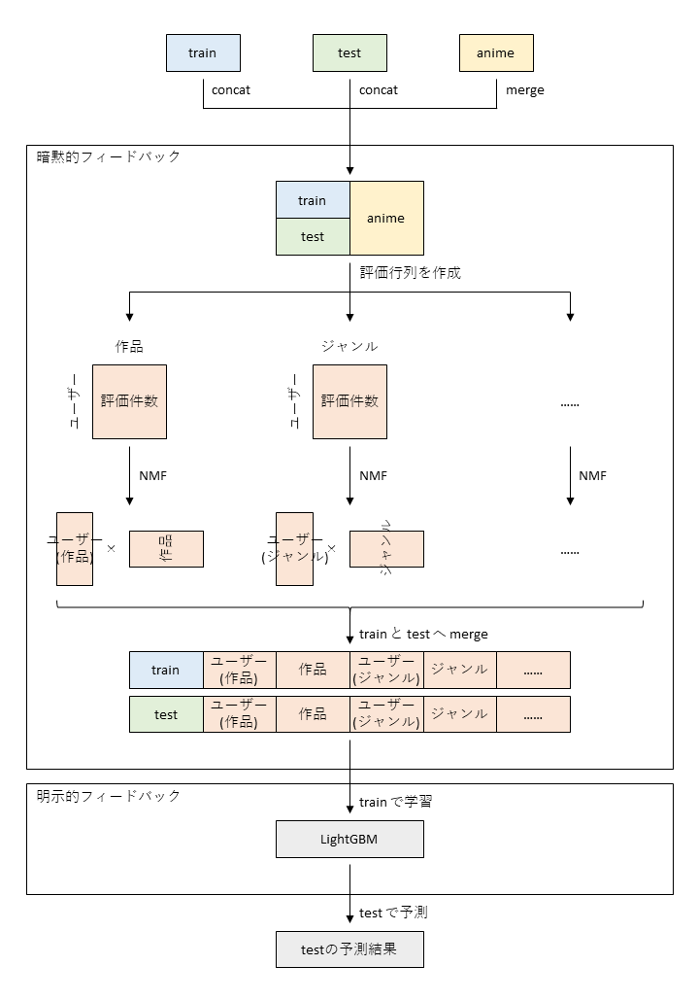

# atmaCup #15 3rd Place Solution

atmaCup[「#15 アニメ作品のユーザー評価を予測せよ！」](https://www.guruguru.science/competitions/21/)の 3rd place solution です。

以下、[ディスカッション](https://www.guruguru.science/competitions/21/discussions/6c9d59b3-8362-43f8-a7db-f263e70bc58e/)へ投稿した内容を転載します。

## 主なアイデア

暗黙的フィードバックを特徴量として抽出し、明示的フィードバックをLightGBMで学習する、という2段階に分けてユーザーからのフィードバックを予測に活用しました。

## 特徴量

作成した特徴量は以下の通りです。

- NMF特徴量 (行：ユーザー、列：下記のカテゴリー、値：評価件数、の評価行列をNMFで分解して作ったユーザーベクトルとカテゴリーベクトル)
  - 作品 `anime_id`
  - ジャンル `genres`
  - 制作会社 `producers`
  - ライセンス所有者 `licensors`
  - スタジオ `studios`
  - 作品の元ネタ `source`
  - IP (作品名 `japanese_name` の先頭4文字)
- 各ユーザーの評価件数
  - 総評価件数
  - ジャンル別の評価件数
  - 該当作品と同じIPの評価件数
- その他
  - `aired` から抽出した放映年
  - `dropped` と `plan_to_watch` の比
  - その他の数値変数やカテゴリー変数はそのままLightGBMへ投入

## モデル

LightGBMを使いました。
`feature_fraction` を小さめに設定しつつ、ゆっくり学習させると精度が上がりました。
おそらく特徴量の数が多かったからだと思います。

- `'objective': 'regression'`
- `'learning_ratio': 0.01`
- `'feature_fraction': 0.7`

## アンサンブル

以下のモデルの予測結果を平均しました。
学習データ全件で学習させたモデルを加えるとPublic LBが上がりました。

- NMFの次元数を変えたモデル
- NMFを適用する前に `genres` 以外の複数カテゴリー変数を分割したモデルと、分割しなかったモデル
- 乱数シードを変えたモデル
- CVの各foldで学習させたモデルと、学習データ全件で学習させたモデル

## CV戦略

テストデータ同様、検証データの23％が未知ユーザーになるように分割しました。
